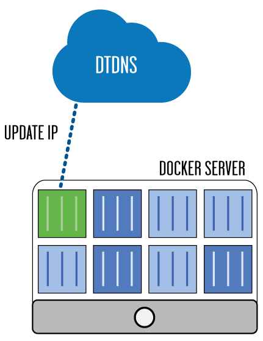

## docker-dtdns

Dockerized dtdns client written in Go

#### FEATURES
- Lightweight Image - ~3.67MB (FROM scratch, no distro)
- Solid Cron Routine - based on github.com/robfig/cron
- Efficient - Updates only if ip has changed
- Flexible - Customizable with a set of parameters

#### HOW IT WORKS

It follows the guidelines defined by the DtDNS specification:
http://www.dtdns.com/dtsite/updatespec

#### USAGE

